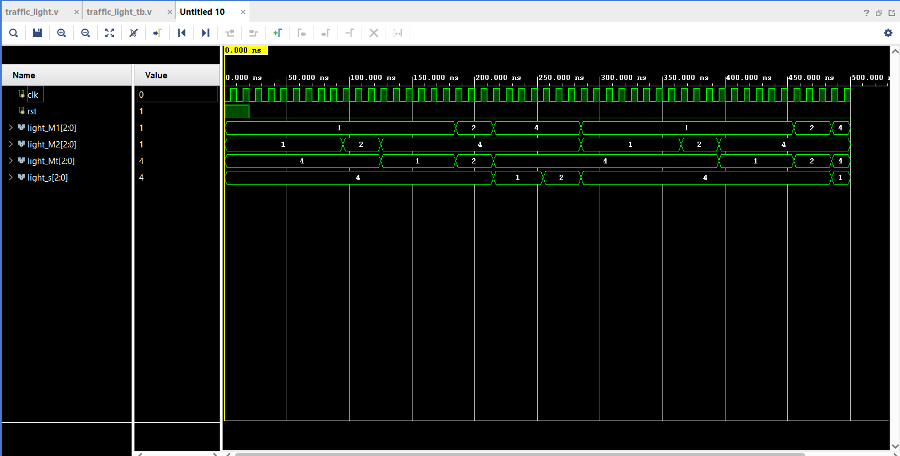

#  Traffic Light Controller (Verilog - Xilinx Vivado)

This project implements a **Traffic Light Controller** using **Verilog HDL**, designed and simulated in **Xilinx Vivado**.
It uses a **Finite State Machine (FSM)** to control traffic lights for a main road, side road, and turn signals.

---

## Overview

The controller operates with six states:
- **S1–S6** represent different Red, Yellow, and Green light combinations.
- Each state remains active for a few clock cycles (2–7).
- The system resets to the initial state when `rst = 1`.

Outputs include:
- `light_M1`, `light_M2` → Main road lights
- `light_Mt` → Turning signal
- `light_s` → Side road signal

---

## Files Included

| File | Description |
|------|--------------|
| `traffic_light.v` | Main Verilog module implementing the traffic light FSM |
| `traffic_light_tb.v` | Testbench for simulating and verifying the design |

---

## How to Simulate in Vivado

1. Open **Xilinx Vivado**
2. Create a new **Project**
3. Add these files:
   - `traffic_light.v` → under **Design Sources**
   - `traffic_light_tb.v` → under **Simulation Sources**
4. Set `traffic_light_tb` as the **Top Module**
5. Click **Run Simulation → Run Behavioral Simulation**
6. In the simulation toolbar, set **Run Time = 2000 ns**
7. Observe the waveform:
   - `light_M1`, `light_M2`, `light_Mt`, and `light_s` will toggle between Red, Yellow, and Green states
8. Use **Zoom Fit** to see the full cycle

---

##  Timing Information

| Signal | Description |
|---------|-------------|
| Clock period | 5 ns |
| Reset | Active High (`rst = 1`) |
| State durations | 2–7 clock cycles depending on FSM state |

---

## Project Structure

```Traffic Light Controller/
├── Traffic Light Controller.srcs/
│ ├── sources_1/
│ │ └── new/
│ │ └── traffic_light.v # Main Verilog design file
│ └── sim_1/
│ └── new/
│ └── traffic_light_tb.v # Testbench for simulation
├── Traffic Light Controller.xpr # Vivado project file ```

## Simulation Result

Below is the waveform output from Xilinx Vivado:


